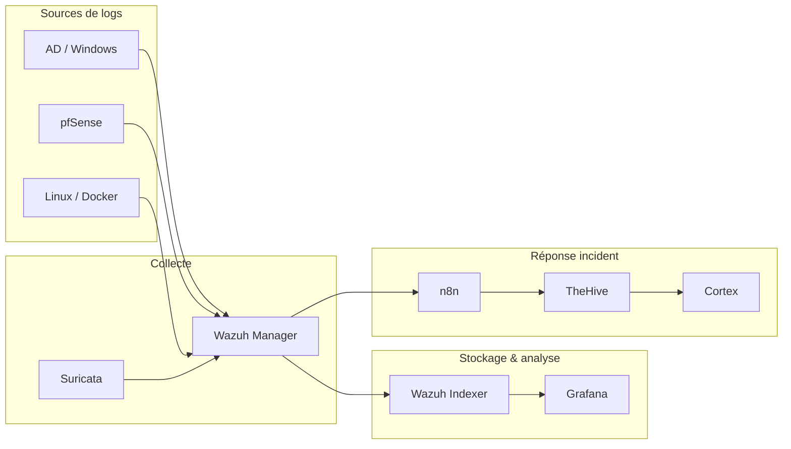

# Architecture SOC

## Pipelines à implémenter

1. **Détection** : règles Wazuh + alertes Suricata
2. **Enrichissement** : Cortex analyzers sur IOC
3. **Orchestration** : n8n reçoit webhook Wazuh → case TheHive + email
4. **Visualisation** : Grafana (metrics + logs agrégés si Loki/Elastic plus tard)

## Règles d’équipe

- Toute nouvelle règle de détection : PR + test sur événement simulé
- Faux positifs documentés dans `docs/wiki/soc-regles.md` (à créer)
