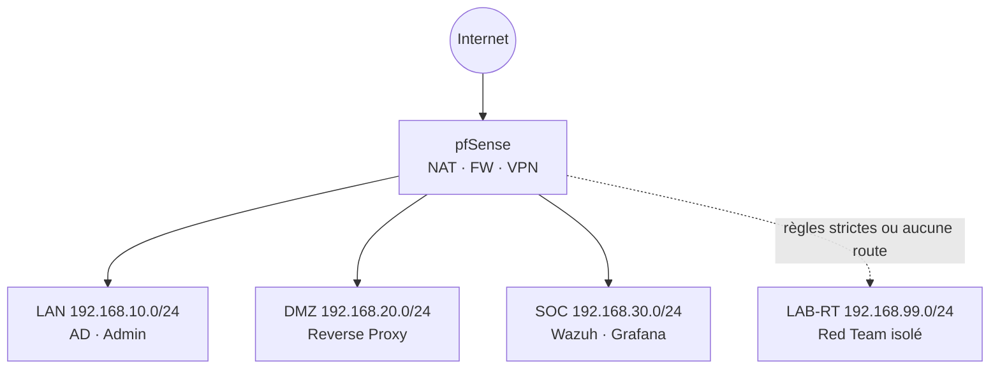

# Topologie réseau

## Schéma logique (v0)

## Flux à documenter

1. **Logs AD / Windows** → collecteur Wazuh (ports, pare-feu)
2. **Suricata** : SPAN/miroir depuis quel segment ?
3. **VPN site-to-site** : pair distant (école, autre site simulé)
4. **Reverse proxy** : TLS termination, backends en DMZ

## Fichiers complémentaires

- Export draw.io / PNG : placer dans `docs/architecture/diagrams/`
- Table des règles pfSense : `docs/procedures/pfsense-regles.md` (à créer)

## Validation

- [ ] Schéma validé par les 4 (date : ______)
- [ ] Règles « deny by default » sur LAB-RT vers LAN
